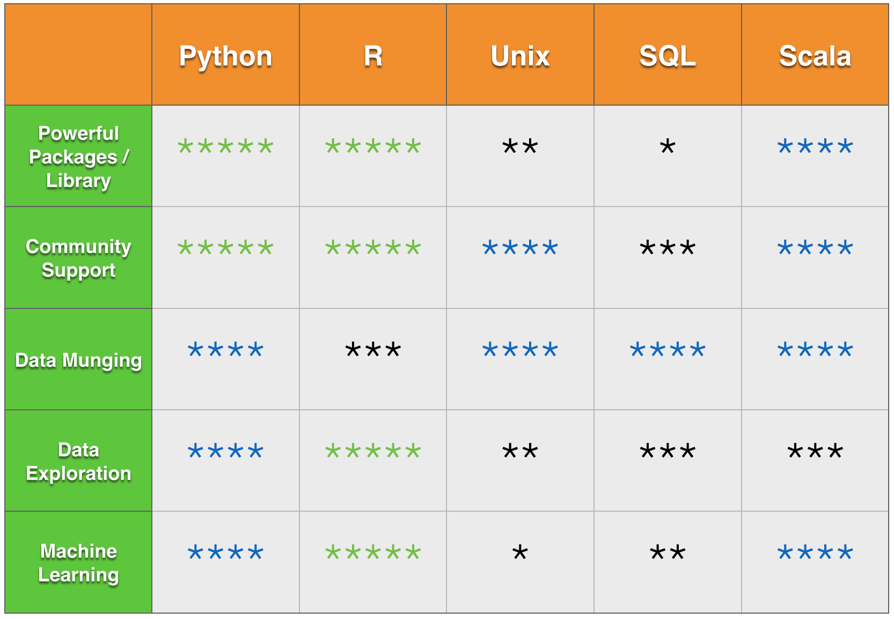
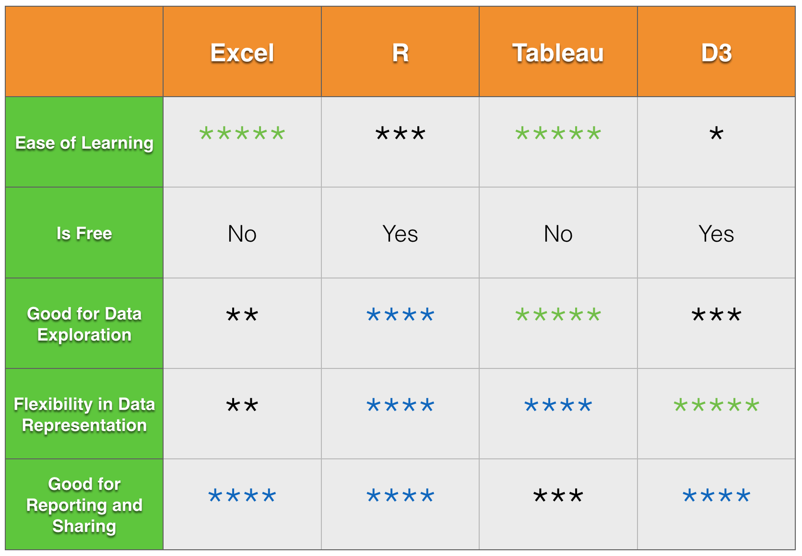

# Data-Science-in-Action

----

### Data Science in Action

- Presentationd Deck
    - [LaTeX](presentation/Data_Science_in_Action.tex)
    - [PDF](presentation/Data_Science_in_Action.pdf)

- Demo in R: Customer churn model
    - [Churn Model Demo in R](src/churn.R)

### [Data Science Articles](articles/README.md)

----

##### What is Data Science

##### Data Munging Toolbox

##### Data Visualization Toolbox

----

- Created: 03.12.2015
- Last Updated: 03.22.2015