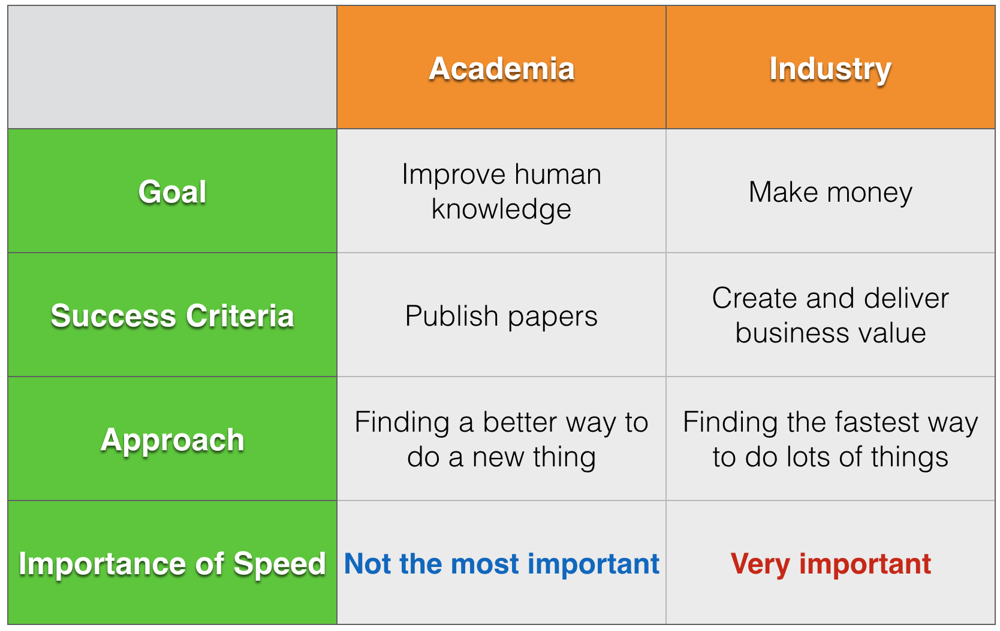

# From academia to industry

----

Years ago I asked a college classmate who's a professor in BioStatistics about how her students conducted statistical analysis in terms of software, she quickly mentioned:"Sometimes they uses Python to chunk up a big file, and then used R to analyze the data sets.. well as long as they got the work done I don't really care how they did it."
Lately I had a conversation with an experienced software engineer. She mentioned the kind of codes she saw her fellow graduate students wrote during graduate school, commenting that "academic people don't care to write good codes and it's impossible to even try to fix them."

I can only imagine how awful academic people write their codes. For one thing, I've been a long-time LaTeX user, and I don't even want to look at the source files I wrote myself. They are completely out of shape and formatting, not to mention proper commenting. The whole purpose of writing those codes was to get the documents done. As long as I can make the PDF output look right, my job is done there.

On the other hand, in the culture of programming, writing beautifully readable codes and maintaining a decent sense of algorithm to limit the compilation time are both as important as the ability to write those codes to begin with. The reasoning is simple: the codes you wrote today will most likely have to be maintained and read by other people. In the industry, most of the time, having your codes sharable is the No.1 business. Why so?

It's probably easy to conclude that academic people don't write good codes because they are not able to, or that they are not trained to do so. I disagree with both statements. I think this phenomenon has to do with the difference in goals between the academia and the industry.

Hence, I'm going to sort this out by taking a goal-oriented top-down approach. Let's start with the goals.

In the academia, the goal is to improve human knowledge, whereas in the industry, the goal is to make money. Without being able to make money a company simply has no future, and without improving the human knowledge the academia as an existence ceases to be meaningful.

Now, the goal determines the success criteria. In the academia, people are marked with success by publishing papers, so that whatever they produce will be added to the overall human knowledge. On the other hand, in the industry, success is measured by the amount of business value that one delivers, in such a way that the business value will be turned into money making in a short or long term that will contribute to the company's success.

Naturally, the success criteria guides the general approaches. In the academia, the general approach for trying to publish a paper is to look for a better way to do a thing, or to find a way to do a new thing. The ground-breaking factor is important in getting one's results published, in a curious way such that sometimes the ground being broken may look too tiny - but as long as it's a new result, yeah! (I just want to quickly mention the mindless-ness in judging an academic person's success by counting the number of papers published.) However, on the industrial side, people generally approach delivering business values by teaming up lots of people to do lots of things. Most likely, one doesn't have to look for a new approach to do those things. Generally, industrial people adopt existing methods to create business values - as long as the values are concrete, you are all set!

Finally, coming to why we want to have a toolbox to do data science - based on the above analysis, in the academia speed is not as important as other things such as finding a new result, having a ground-breaking methodology, etc. Whereas in the industry, in a lot of times speed is the single most important factor. On the company level, a startup may survive or die because of its speed to develop new products. It's a bit less obvious on the individual level, but I believe that individuals who maintain a higher speed of delivering business values would have a higher chance to succeed than others.

Therefore, in order to maintain your speed, you need to have a toolbox, like this:

----

- Created: 03.24.2015
- Last Updated: 03.24.2015